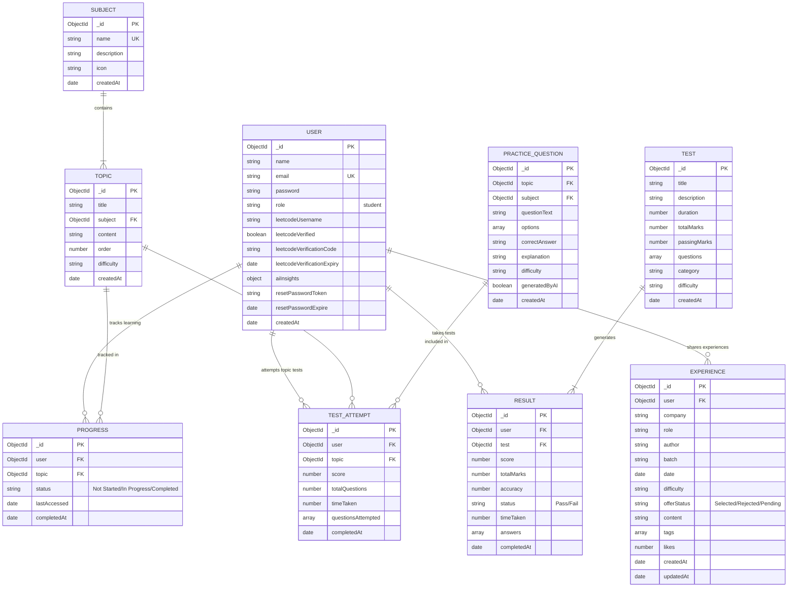
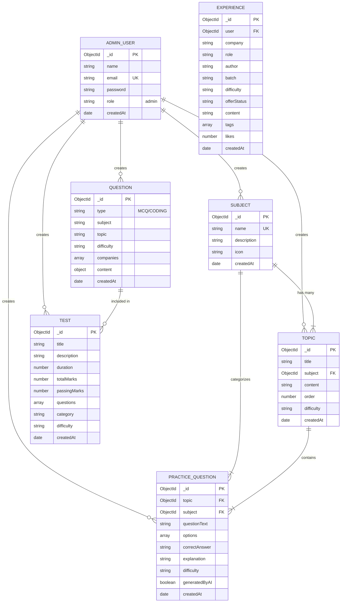
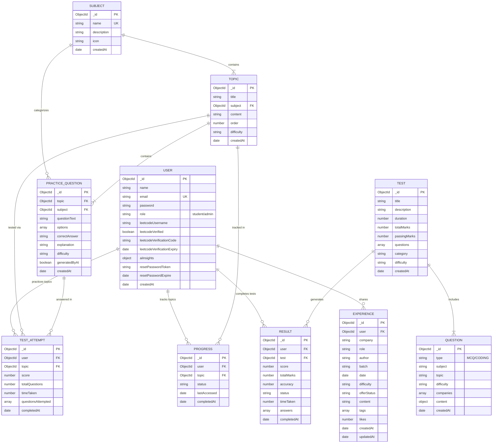
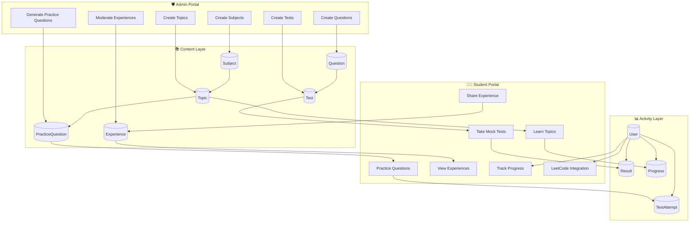

# Placement Saathi - ER Diagrams

This document contains Entity-Relationship (ER) diagrams for the Placement Saathi application, showing the database structure for each portal and how they integrate together.

---

## Table of Contents
1. [Student Portal ER Diagram](#1-student-portal-er-diagram)
2. [Admin Portal ER Diagram](#2-admin-portal-er-diagram)
3. [Complete System ER Diagram](#3-complete-system-er-diagram)

---

## 1. Student Portal ER Diagram

The Student Portal focuses on entities that students interact with during their placement preparation journey.

### Student Portal Entity Descriptions

| Entity | Purpose |
|--------|---------|
| **USER** | Stores student profile, authentication, LeetCode integration, and AI insights |
| **RESULT** | Records test results with scores, answers, and performance metrics |
| **PROGRESS** | Tracks learning progress for each topic |
| **TEST_ATTEMPT** | Records topic-wise practice test attempts |
| **EXPERIENCE** | Stores interview experiences shared by students |
| **TEST** | Mock tests available for students |
| **TOPIC** | Learning topics with markdown content |
| **SUBJECT** | Subject categories (DSA, DBMS, etc.) |
| **PRACTICE_QUESTION** | AI-generated practice questions for topics |

---

## 2. Admin Portal ER Diagram

The Admin Portal focuses on content management entities that administrators use to create and manage the learning platform.

### Admin Portal Entity Descriptions

| Entity | Purpose |
|--------|---------|
| **ADMIN_USER** | Admin users who manage the platform content |
| **SUBJECT** | Create/manage subject categories |
| **TOPIC** | Create/manage learning topics with content |
| **QUESTION** | Create MCQ and Coding questions for tests |
| **TEST** | Create and configure mock tests |
| **PRACTICE_QUESTION** | Create/manage practice questions (AI or manual) |
| **EXPERIENCE** | Moderate interview experiences |

---

## 3. Complete System ER Diagram

This diagram shows how all entities in the Placement Saathi system work together, with clear separation between Admin-managed content and Student interactions.

---

## System Architecture Flow

---

## Entity Summary Table

| Entity | Type | Created By | Used By | Description |
|--------|------|------------|---------|-------------|
| **User** | Core | System | Both | Authentication & user profiles |
| **Subject** | Content | Admin | Student | Subject categories (DSA, DBMS, etc.) |
| **Topic** | Content | Admin | Student | Learning topics with markdown content |
| **Question** | Content | Admin | Student | MCQ/Coding questions for tests |
| **Test** | Content | Admin | Student | Mock tests with multiple questions |
| **PracticeQuestion** | Content | Admin/AI | Student | Practice questions per topic |
| **Result** | Activity | Student | Student | Test completion records |
| **Progress** | Activity | Student | Student | Topic learning progress |
| **TestAttempt** | Activity | Student | Student | Topic practice test records |
| **Experience** | Content | Student | Both | Interview experiences shared |

---

## Key Relationships

### One-to-Many Relationships
- **Subject → Topic**: One subject contains many topics
- **Topic → PracticeQuestion**: One topic has many practice questions
- **Test → Result**: One test generates many results (different users)
- **User → Result/Progress/TestAttempt**: One user has many activity records

### Many-to-Many Relationships
- **Test ↔ Question**: Tests include multiple questions, questions can be in multiple tests (embedded array)

### Foreign Key References
| Entity | References | Field |
|--------|------------|-------|
| Topic | Subject | `subject` |
| PracticeQuestion | Topic, Subject | `topic`, `subject` |
| Result | User, Test | `user`, `test` |
| Progress | User, Topic | `user`, `topic` |
| TestAttempt | User, Topic | `user`, `topic` |
| Experience | User | `user` |

---

## Database: MongoDB

All entities are stored as MongoDB collections using Mongoose ODM. The relationships shown use ObjectId references for foreign keys.
